-----------
# プロペラ設計 図面化スクリプト
-----------
# 概要
xrot_to_fusion_sketchは[xrotor](http://web.mit.edu/drela/Public/web/xrotor/)によるプロペラ設計ファイルから[fusion360](https://www.autodesk.co.jp/products/fusion-360/overview)で図面のスケッチを生成するスクリプトです。fusion360のapiとpythonによって実装しています。以下デモ動画です。


# 使い方
## xrot_to_fusion_sketch
### 準備
#### 手順1
`Autodesk Fusion 360\API\Scripts`フォルダの中に`xrot_to_fusion_sketch`フォルダを貼り付けます。
このフォルダは、私の場合`C:\Users\AccoutName\AppData\Roaming\Autodesk\Autodesk Fusion 360\API\Scripts`に入ってました。

スクリプトを初めて利用する人は、`API\Scripts`フォルダーが無い可能性があります。その場合、適当なスクリプトを作ることでフォルダーが出現します。右クリックからそのファイルの場所を開くとフォルダを見つけやすいです。詳しくは、以下GIFを参照してください。

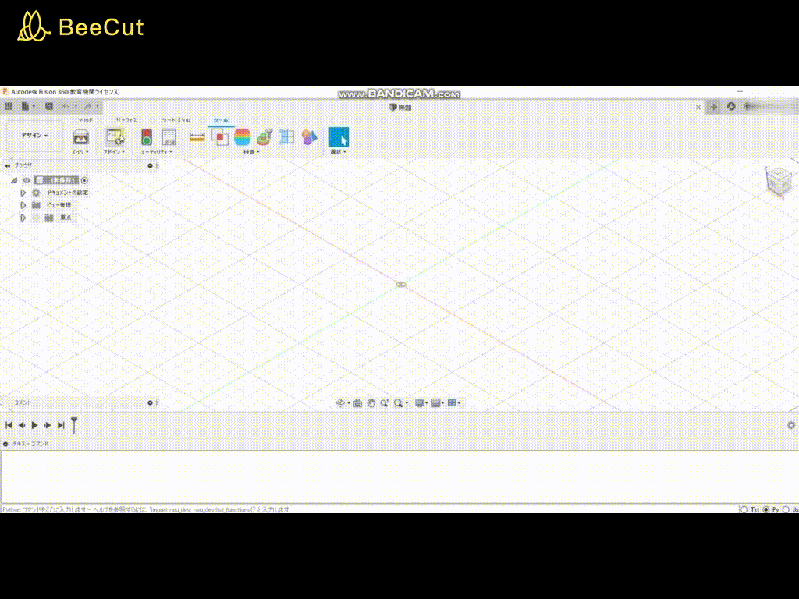

#### 手順2
fusion360を開きアドインをクリックします。

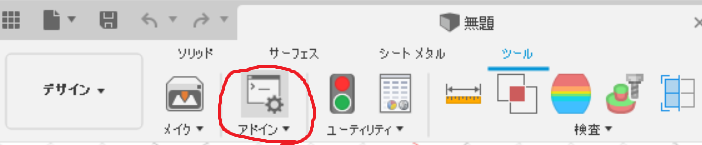

#### 手順3
手順1で入れたスクリプト`xrot_to_fusion_sketch`が反映されているので、選択して実行ボタンをクリックします。

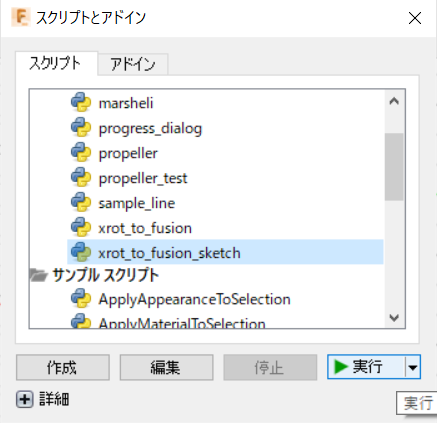

すると入力ダイアログが出現します。

入力方法については次の項目で説明します。

### 入力
入力ダイアログでは以下の3つの項目を設定できます。
- param : 桁穴の大きさや治具の高さなどを指定
- mix foil : 翼型の混合比率を指定
- option : 出力するパーツを指定
#### param
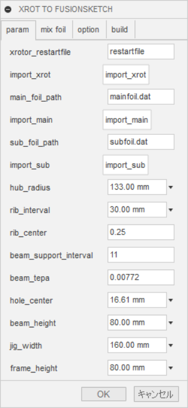
- xrotor_restartfile : xrotorのsaveコマンドで得られる設計ファイル(restartfile)
- main_foil_path : ペラ中央に使う翼型のdatファイルパス
- sub_foil_path : ペラ根、端で使う翼型のdatファイルパス\
上記3つは下のimportボダンで参照可能
- hub_radius : ハブ半径[mm]\(図1参照\)
- rib_interval : リブ間隔[mm]\(図3参照\)
- rib_center : 桁穴を通す位置(百分率)(図4参照)
- beam_support_interval : 桁の支柱をリブ何個ごとに配置するか(図3参照。図3の場合6)
- beam_tepa : 桁のテーパ(図2参照)
- hole_center : 桁を回転中心まで伸ばしたときの桁直径(図2参照)
- beam_height : 桁を支える高さ(図3参照)
- jig_width : 治具の幅(土台の横幅)(図3参照)
- frame_height : 土台の縦幅(図3参照)

各パラメータは以下図参照

||
|:----:|
|図1:hub radius|
||
|図2:beam|
|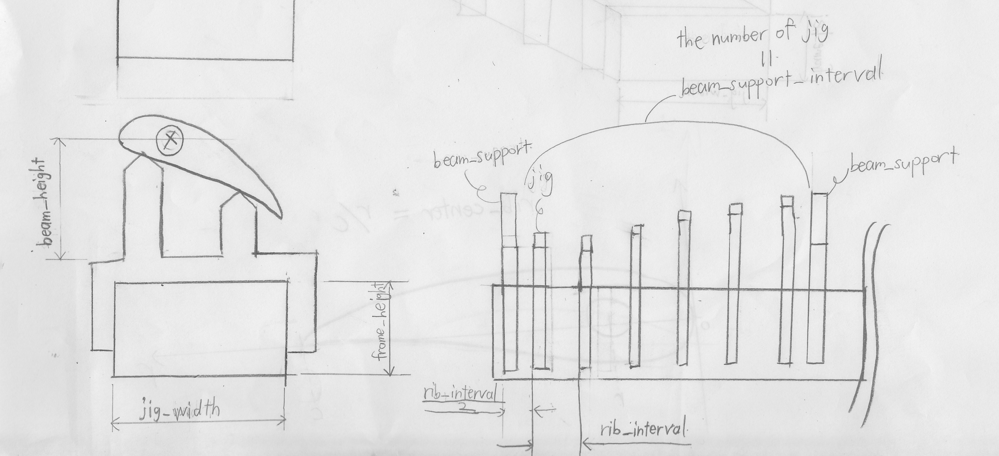|
|図3:jig views|
|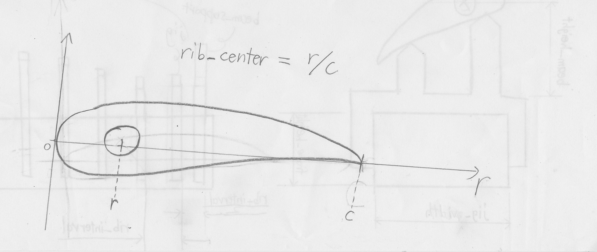|
|図4:rib center|

#### mix foil
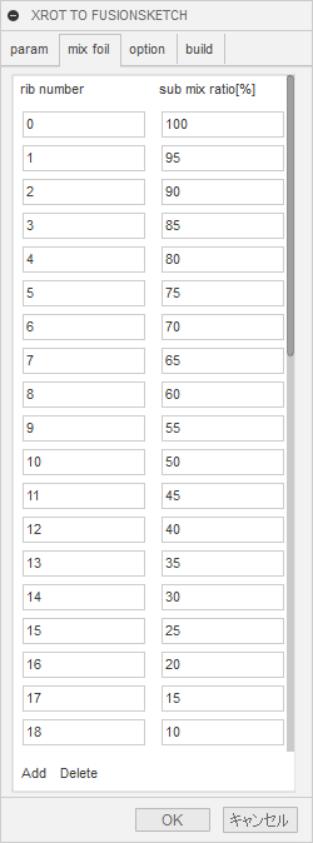

指定がなければ、main_foil_pathに指定した翼型のみで出力されます。

rib numberに指定したリブ番号については、\
main_foil : sub_foil = 100 - sub mix ratio : sub mix ratio\
の割合で混合されます。

- rib number : sub_foilを混合するリブ番号
- sub mix ratio : sub_foilの混合する割合(%)

##### 例
- 0番リブでmain : sub = 0 : 100
- 5番リブでmain : sub = 50 : 50

にするときの設定

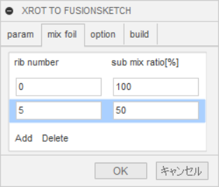

#### option

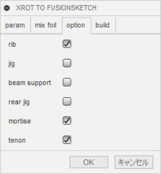
- rib : リブ
- jig : 治具
- beam support : 桁支柱
- rear jig : 後縁治具
- mortise : ほぞ穴
- tenon : ほぞ

チェックを入れたパーツのみが出力されます。
### 実行
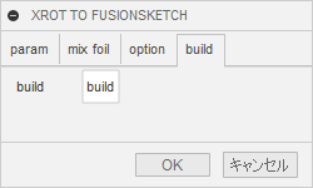

buildボタンを押すと入力に応じた図面が出力されます。

↓図面出力中画面

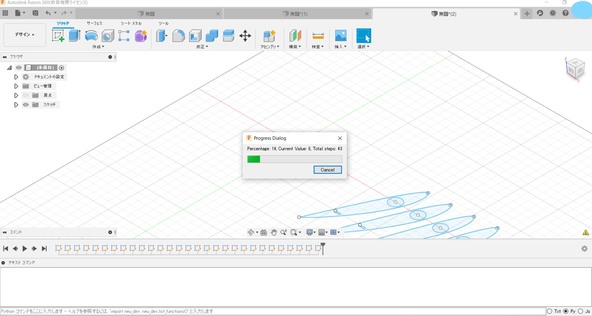

↓optionにrib、mortise、tenonを指定した時の出力

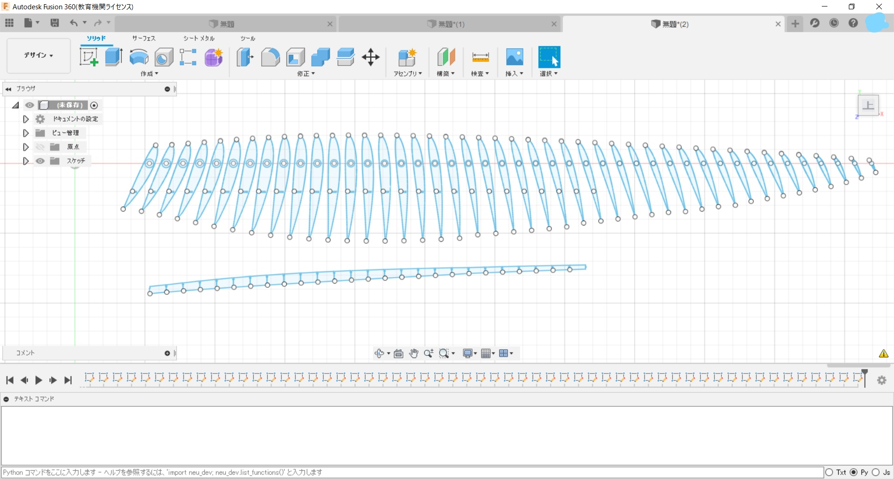

## xrot_to_vs
プログラム先頭の
```
#=======================================================================
#--------------------------------入力部分--------------------------------
#=======================================================================
# リブのオフセット(バルサの場合、外皮の厚み分)[mm]
rib_offset = 1
~
~
# フレーム高さ[mm]
frame_hei = 80
#=======================================================================
#--------------------------------入力終了--------------------------------
#=======================================================================
```
を書き換えて使用します。

入力内容はxrot_to_fusion_sketchと同じです。

## aero_for_xrot
準備中
